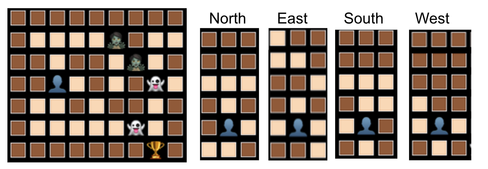

# monster-maze-console
Monster Maze Console Game

Seeking inspiration for a Halloween post I came across Peter Pravos' [Celebrate Halloween with Creepy Computer Games in R](https://lucidmanager.org/data-science/creepy-computer-games-in-r/).

Following his example I decided to translate into R one of the other creepy games in the book [Creepy Computer Games (Usborne, London)](https://usborne.com/gb/books/computer-and-coding-books). This book and many other wonders are available in the previous link. 
The book collection has been a completely unexpected discovery, I am really thankful to Peter for such an interesting series in his blog.

The books are richly coloured with beautiful illustrations everywhere. There is a big contrast between the illustrations and the simple graphics of the games in [ZX Spectrum](https://en.wikipedia.org/wiki/ZX_Spectrum) and [BBC Micro](https://en.wikipedia.org/wiki/BBC_Micro). I was considering if the book was trying to compensate somehow, but now I just think that the same imagination that was powering the illustrations was also behind the graphics, so the  contrast is due to the different degree of development of the the tools. 

For this occasion I have selected "Ghost Maze" written by Colin Reynolds.

# How to run it

The game requires RStudio or Rscript.

**Make sure to choose a MONOSPACE font (like 'Courier', 'Monaco', 'Andale Mono', 'Lucida Console' or any other 'Mono' font) in your terminal/console.**

## Option 1: RStudio Console

* Download and unzip the repo
* Open the project in RStudio double clicking on **monster-maze-console.Rproj**
* Source the file R/monster-maze-all.R
* The game runs on the RStudio console
* Move to the console to enter the input
 
## Option 2: RStudio Console

* In Github, copy the code from **R/monster-maze-all.R**
* Open a new file in RStudio
* Paste the contents
* Source the new file
* The game runs on the RStudio console
* Move to the console to enter the input

## Option 3: Terminal
* Download and unzip the repo
* Open a terminal
* Run the command **Rscript \<path_to_the_unzipped_repo\>/R/monster-maze-all.R**

